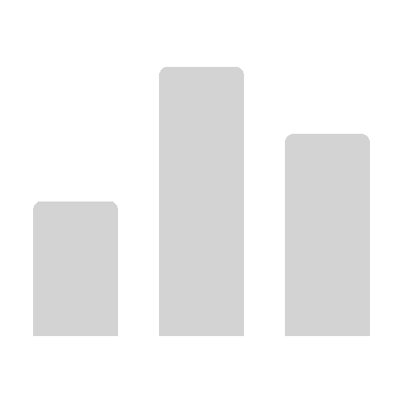
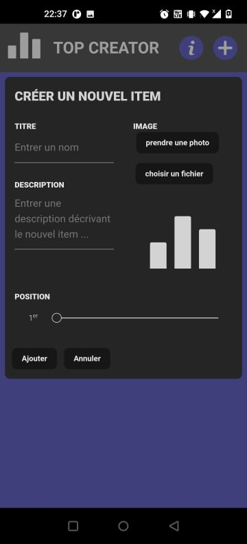
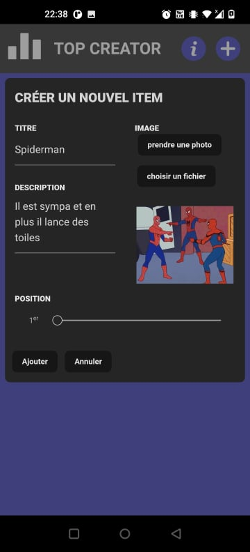
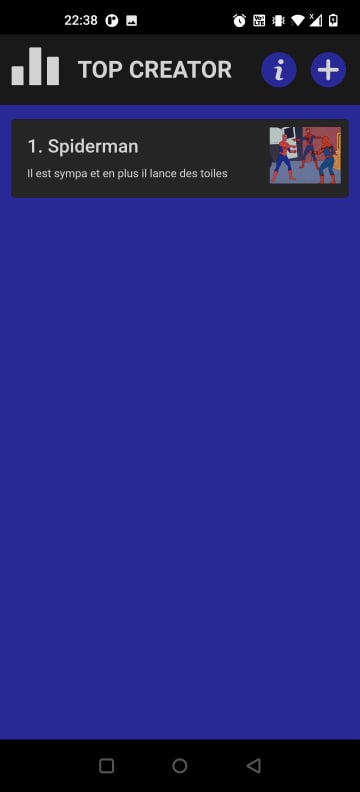
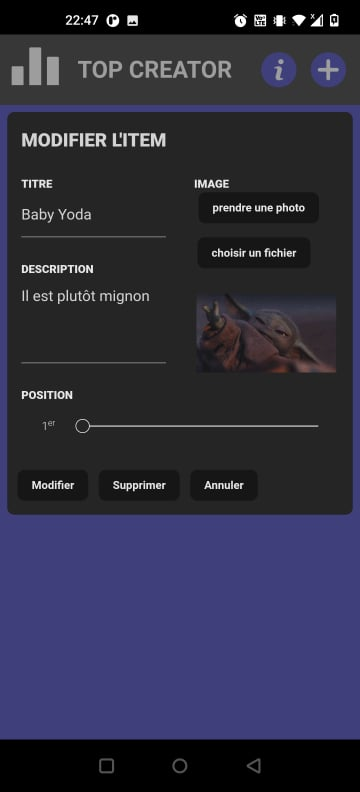
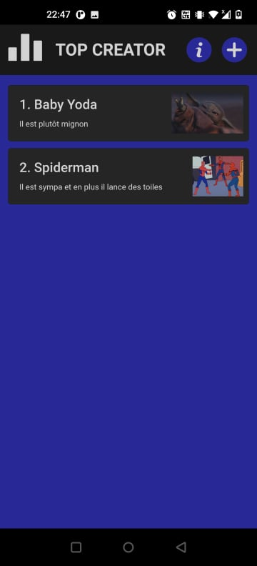

# Top Creator

  

Ce projet a été réalisé avec [Cordova](https://cordova.apache.org/).

Il inclu les plugins suivants :

- [file](https://cordova.apache.org/docs/en/10.x/reference/cordova-plugin-file/index.html)
- [camera](https://cordova.apache.org/docs/en/10.x/reference/cordova-plugin-camera/index.html)
- [inappbrowser](https://cordova.apache.org/docs/en/10.x/reference/cordova-plugin-inappbrowser/index.html)
- [splashscreen](https://cordova.apache.org/docs/en/10.x/reference/cordova-plugin-splashscreen/index.html)
- [screen-orientation](https://cordova.apache.org/docs/en/10.x/reference/cordova-plugin-screen-orientation/index.html)

⚠️ Les plugins camera et file ne sont pas compatibles sur android : Un bug connu empêche d'utiliser les `cdvfile` dans les versions de plateforme > 10, or le plugin camera nécessite une version >= 10 pour fonctionner 

> https://github.com/apache/cordova-android/issues/1361

## Lancer le projet 

### PWA

Sur Visual Studio Code ouvrir le dossier `/www`, clique droit sur le fichier `index.html` puis `Open with Live Server` (l'extension [Live Server](https://marketplace.visualstudio.com/items?itemName=ritwickdey.LiveServer) est necessaire)

### Browser

Sur Visual Studio Code ouvrir le dossier racine

> cordova add platform browser

> cordova emulate browser

### Android

Sur Visual Studio Code ouvrir le dossier racine

> cordova add platform android

> cordova run android

## Fonctionnement

L'application permet de créer des "items", de leur atribuer un nom, une description, une image et une position dans le classement.

  
  
  

Il est également possible de modifier l'item et sa position dans le classement, ainsi que de le supprimer.

  
  

